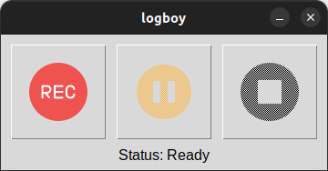

# Logboy

Logboy is a powerful tool designed to record ROS 2 `.mcap` files. It seamlessly integrates with the recording management system [Bagman](https://github.com/yannikmotzet/bagman/tree/main) to provide a comprehensive solution for managing your recordings.

<p align="center">
    
</p>

<p align="center">
    
</p>

<details>
    <summary>Table of Contents</summary>

- [Features](#features)
- [Prerequisites](#prerequisites)
- [Installation](#installation)
- [Contributing](#contributing)

</details>

## Key Features

- **Command-Line Interface (CLI)**: Efficient and scriptable recording control.
- **Graphical User Interface (GUI)**: Intuitive and user-friendly interface for managing recordings.
- **Topic Monitoring**: Real-time monitoring of ROS 2 topics.
- **Configuration via YAML**: Flexible `.yaml` file-based setup for storage locations, topic selection, and metadata (e.g., descriptions).
- **Integration with Bagman**: Simplified upload and management of recordings.

## Prerequisites
TBD

## Installation
TBD

## Run
TBD

## Contributing

Use pre-commit:

1. Install pre-commit:
    ```sh
    pip install pre-commit
    ```

2. Run pre-commit:
    ```sh
    pre-commit
    ```