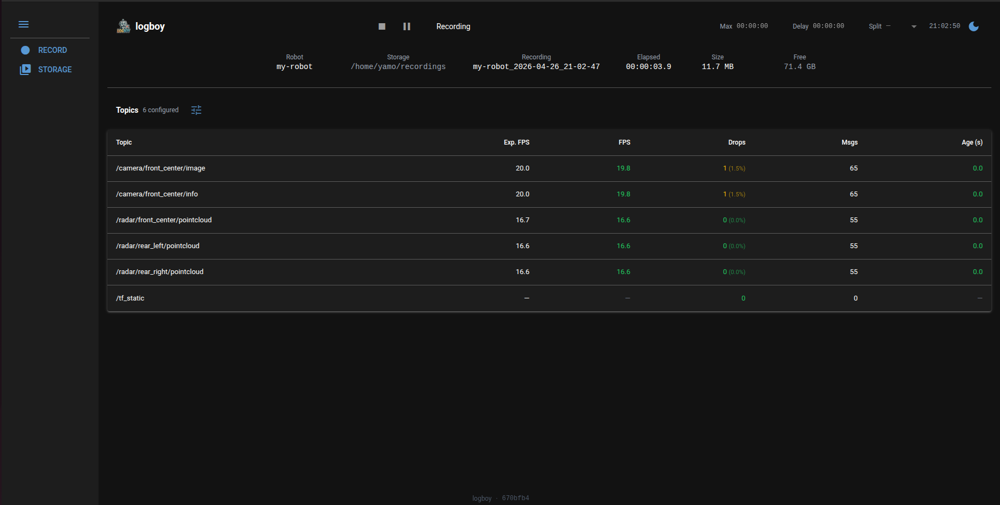
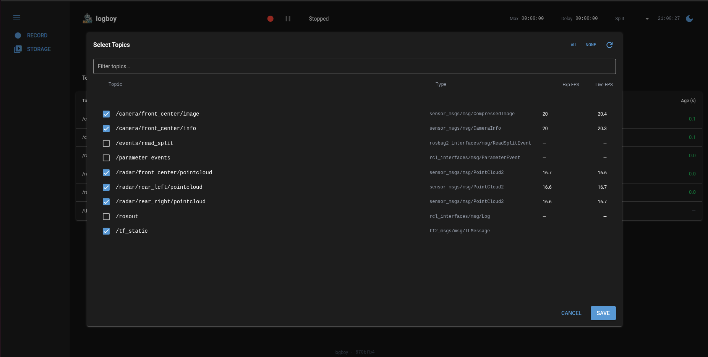
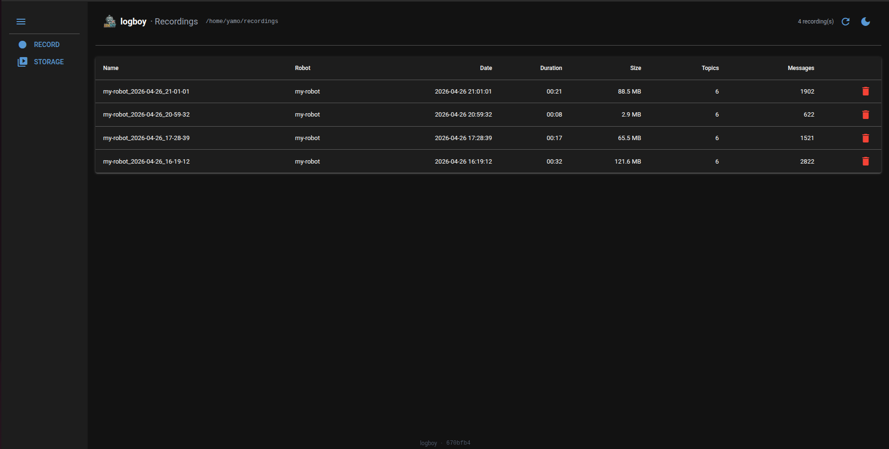
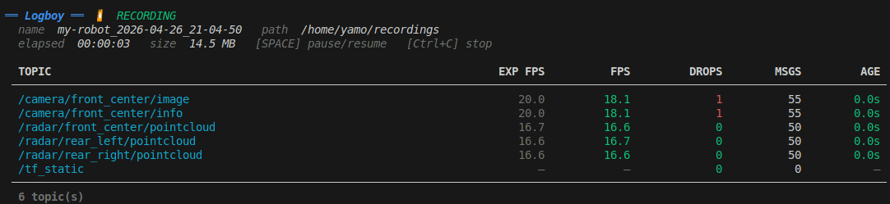
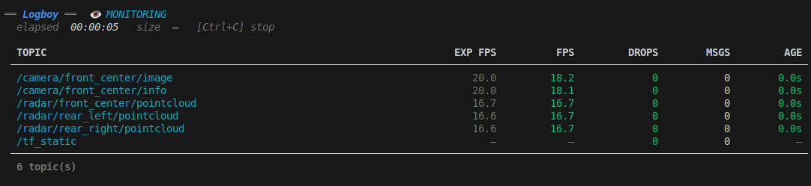
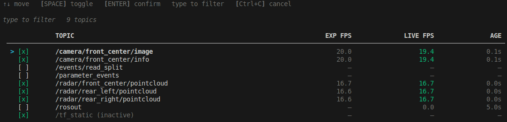
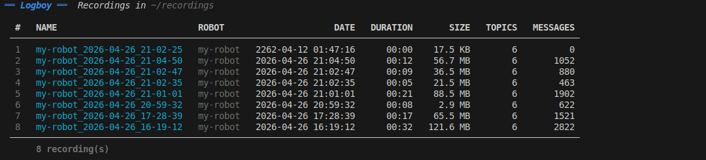

# Logboy

Logboy is a ROS 2 `.mcap` recording tool with both a CLI and a web-based GUI. It provides real-time topic monitoring, interactive topic selection, and integrates with [Bagman](https://github.com/yannikmotzet/bagman/tree/main) for recording management.

> **Note:** This tool is in development. Some features are not yet implemented.

<p align="center">
    
</p>

<details>
    <summary>Table of Contents</summary>

- [Features](#features)
- [Prerequisites](#prerequisites)
- [Installation](#installation)
- [Usage](#usage)
  - [GUI](#gui)
  - [CLI](#cli)
- [Contributing](#contributing)

</details>

## Features

- **Recording**: Record ROS 2 topics to `.mcap` files with configurable storage path, robot name, max duration, and delay.
- **Topic Monitoring**: Real-time FPS, drop rate, and age tracking for all subscribed topics.
- **Interactive Topic Selection**: Select and filter topics interactively from the CLI or GUI.
- **Web GUI**: Browser-based interface with live topic monitor, recording controls, and a storage browser.
- **YAML Configuration**: Flexible `.yaml` file for storage path, robot name, topic list, and expected FPS values.
- **Integration with Bagman**: Simplified upload and management of recordings.

## Prerequisites

TBD

## Installation

TBD

## Usage

### GUI

Start the GUI:
```sh
logboy_gui --config path/to/config.yaml
```

**Record page** — live topic monitor with FPS, drops, and message counts. Controls for max duration, start delay, and pause/resume.

<p align="center">
    
</p>

**Topic selection dialog** — filter and select topics with live FPS, message type, and configurable expected FPS.

<p align="center">
    
</p>

**Storage page** — browse, inspect, and delete recordings.

<p align="center">
    
</p>

### CLI

**Record topics:**
```sh
logboy record -c path/to/config.yaml
```

<p align="center">
    
</p>

**Monitor topics without recording:**
```sh
logboy monitor -c path/to/config.yaml
```

<p align="center">
    
</p>

**Select topics interactively:**
```sh
logboy topics -c path/to/config.yaml
```

Use `↑↓` to navigate, `Space` to toggle, type to filter, and `Enter` to confirm. The selection is saved back to the config file.

<p align="center">
    
</p>

**Browse recordings:**
```sh
logboy recordings -c path/to/config.yaml
```

<p align="center">
    
</p>

## Contributing

Use pre-commit:

1. Install pre-commit:
    ```sh
    pip install pre-commit
    ```

2. Run pre-commit:
    ```sh
    pre-commit
    ```
